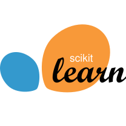
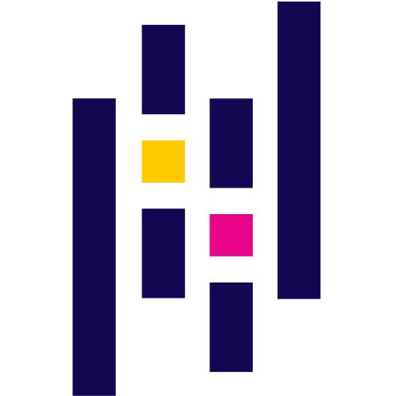
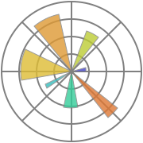
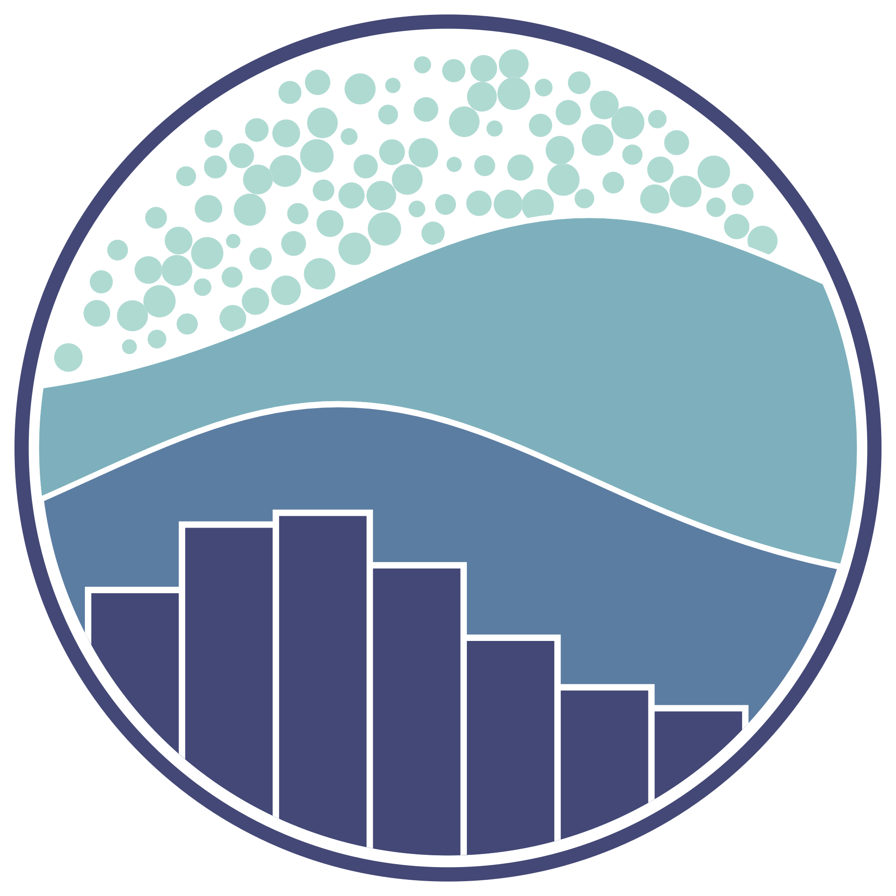

<h3 align="center">
  <samp> Hi, I'm Charles, an engineer and software developer. I'm experienced and interested in digital signal processing, computer vision and applied artificial intelligence. 
  </samp>
</h3>

 

   &nbsp;
   &nbsp;
  

 
 

  <!-- languages -->
   &nbsp;
   &nbsp;
  <!-- artificial intelligence -->
   &nbsp;
   &nbsp;
   &nbsp;
   &nbsp;
  <!-- math -->
   &nbsp;  
   &nbsp;
   &nbsp;
   &nbsp;
  

